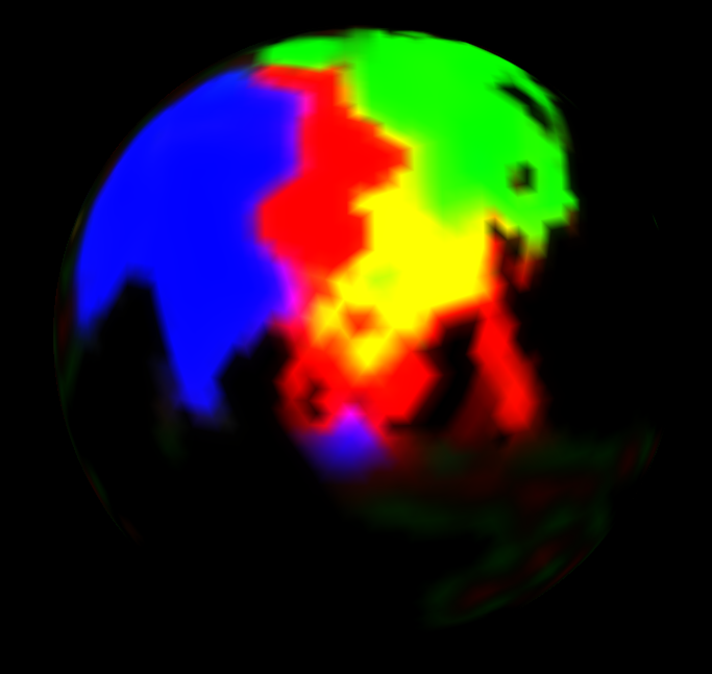
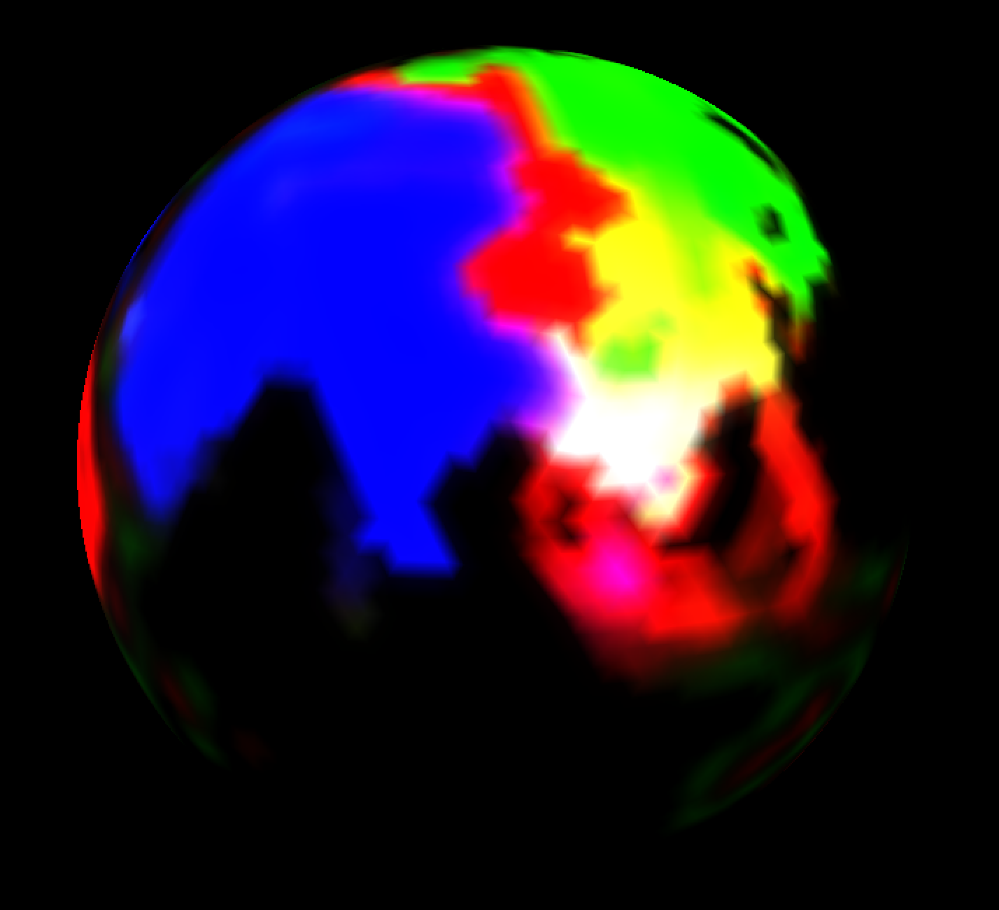

# impera-simulator
A simulator for populations living and sharing resources on a (spherical) map

# optional dependencies
 - OpenGL for the GUI

# how to build
cd src
make
./impera --help
./impera --test '?'

# unit test: internal warning archive
./impera --test warnings

# unit test: control environment
./impera --test control

# unit test: 2D, 3D and 4D arrays in C++
./impera --test data_view

# unit test: icosahedral map construction
./impera --test icomap

# unit test: icosahedral grid construction
./impera --test icogrid

# unit test: generation of .bmp graphic files
./impera --test bitmap

# unit test: color display in terminal
./impera --test color

# unit test: run the simulation in terminal
./impera --test impera

# unit test: run the simulation in a window
./impera --test window
# to quit the window test hit 'q' twice
